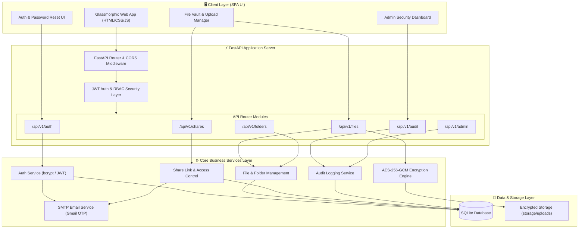

# Secure File-Sharing System

An enterprise-grade, end-to-end encrypted **Secure File-Sharing System** built with **Python 3.10 + FastAPI + SQLite (SQLAlchemy) + AES-256-GCM Encryption + JWT Auth & RBAC + Audit Logging** and a modern, high-aesthetic Glassmorphic Web Dashboard.

Designed and implemented step-by-step according to the 8-Week Development Guide.

---

## 📐 System Architecture Diagram



---

## 🚀 Key Modules & Architecture Breakdown

### 1. Client Layer (Frontend SPA)
- **Glassmorphic UI**: Pure HTML5, CSS3, and JavaScript Single Page Application with dynamic theme toggle (Dark/Light), drag-and-drop file upload zone, real-time audit feed, and interactive security meters.
- **Authentication & Self-Service**: Login, registration, profile settings, and email OTP-based password reset workflow.

### 2. FastAPI Application Server & Security Middleware
- **JWT & Role-Based Access Control (RBAC)**: Enforces token validation and permissions (`ADMIN` vs `USER`) across all endpoints.
- **Path Traversal Guard**: Prevents path injection attacks using strict filename sanitization routines.

### 3. Core Business & Cryptographic Services
- **AES-256-GCM Encryption Engine**: Encrypts file data using AES-256 in GCM mode before saving to disk storage. Generates a unique 12-byte initialization vector (IV) per file.
- **Granular Share Manager**: Supports expiration timers, maximum download counters, password protection, and instant link revocation.
- **Security Audit Logger**: Records immutable event logs (`LOGIN_SUCCESS`, `LOGIN_FAILED`, `FILE_UPLOADED`, `FILE_DOWNLOADED`, `UNAUTHORIZED_ACCESS`).
- **SMTP Notification Engine**: Dispatches security OTP codes and file sharing invitation links via Gmail SMTP.

### 4. Data & Storage Layer
- **Relational Storage (SQLite + SQLAlchemy)**: Manages relational data for Users, File Metadata, Share Tokens, Folder Hierarchy, and Audit Trail.
- **Encrypted Binary File Payload Store**: Stores raw encrypted file payloads (`.bin`) isolated in the `storage/uploads/` directory.

---

## 🛡️ Key Security & Technical Features

- **AES-256-GCM File Encryption**: All uploaded files are encrypted with unique nonces before being saved to storage disk. Decryption occurs only upon authenticated & authorized download requests.
- **JWT & Role-Based Access Control (RBAC)**: Secure user authentication with password hashing (bcrypt) and strict permission levels (`ADMIN`, `USER`).
- **Path Traversal & Injection Defenses**: Filename sanitization against malicious paths like `../../private_file`.
- **Granular File Sharing Controls**:
  - Expiration Date/Time support (auto-blocks access after link expires).
  - Maximum Download Limit enforcement (atomic counter blocks access once limit is reached).
  - Share Revocation by owner at any time.
  - Permission levels (`VIEW`, `DOWNLOAD`, `EDIT`).
- **Activity Monitoring & Audit Logging**: Captures detailed audit records for `USER_REGISTERED`, `LOGIN_SUCCESS`, `LOGIN_FAILED`, `FILE_UPLOADED`, `FILE_DOWNLOADED`, `FILE_DELETED`, `FILE_SHARED`, `SHARE_REVOKED`, `UNAUTHORIZED_ACCESS`.
- **Admin & User Dashboards**: Real-time security metrics, failed attempt feeds, storage meters, drag-and-drop file upload, file details modal, and search/sort controls.

---

## 🛠️ Project Structure

```text
secure-file-sharing-system/
├── app/
│   ├── main.py                   # FastAPI application initialization & routing
│   ├── config/
│   │   └── settings.py           # Environment variables, security configs
│   ├── database/
│   │   ├── session.py            # SQLAlchemy database engine & sessions
│   │   └── init_db.py            # Initial DB tables & demo seed users
│   ├── models/                   # User, File, FileShare, AuditLog ORM models
│   ├── schemas/                  # Pydantic validation schemas
│   ├── routes/                   # API endpoint routers (/health, /auth, /files, /shares, /audit, /admin)
│   ├── services/                 # Business logic services (auth, file, encryption, share, audit)
│   ├── security/                 # Password hashing, JWT token creation, RBAC dependencies
│   └── utils/                    # Path security & file metadata validators
├── static/                       # Frontend SPA (index.html, style.css, app.js)
├── storage/uploads/              # AES-256 encrypted file payload storage
├── tests/                        # Automated test suites covering Weeks 1 through 8
├── requirements.txt              # Python package dependencies
└── README.md                     # Documentation
```

---

## 🚀 Getting Started

### 1. Install Dependencies
```bash
py -m pip install -r requirements.txt
```

### 2. Run the Application Server
```bash
py -m app.main
# or
py -m uvicorn app.main:app --port 8000 --reload
```

Open your browser at **`http://localhost:8000`** to access the Web Application UI.

---

## 🧪 Running Automated Tests

Run the comprehensive test suite across all 8 weeks:
```bash
py -m pytest -v tests/
```

---

## 🔑 Demo Login Credentials

The application automatically seeds standard demo accounts upon startup:

- **Demo User A**: `usera@secure.local` | Password: `UserSecret123!`
- **Demo User B**: `userb@secure.local` | Password: `UserSecret123!`
- **Demo Admin**: `admin@secure.local` | Password: `AdminSecret123!`
